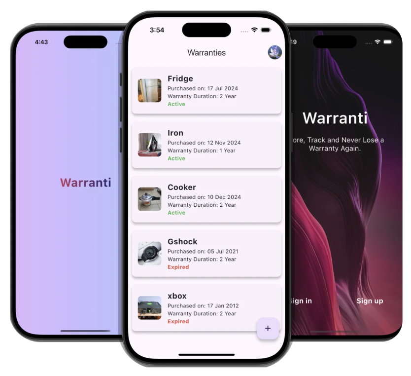
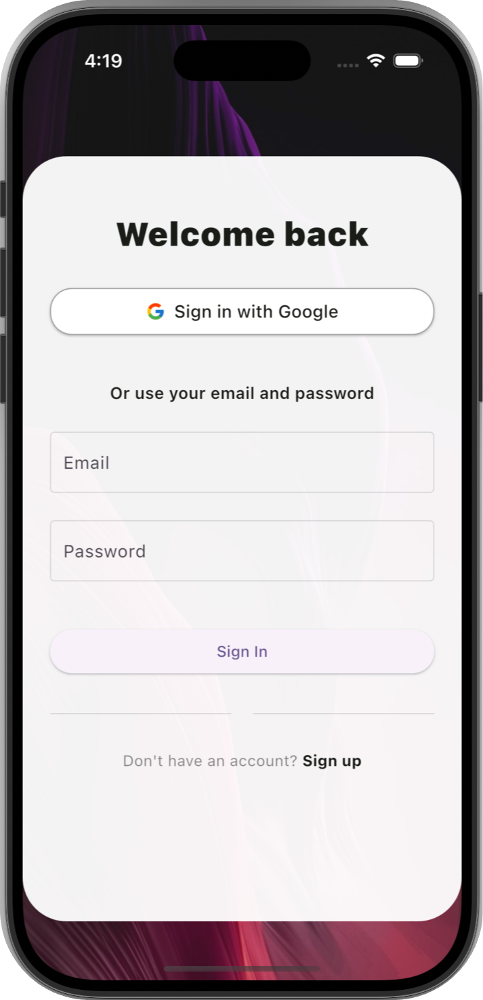
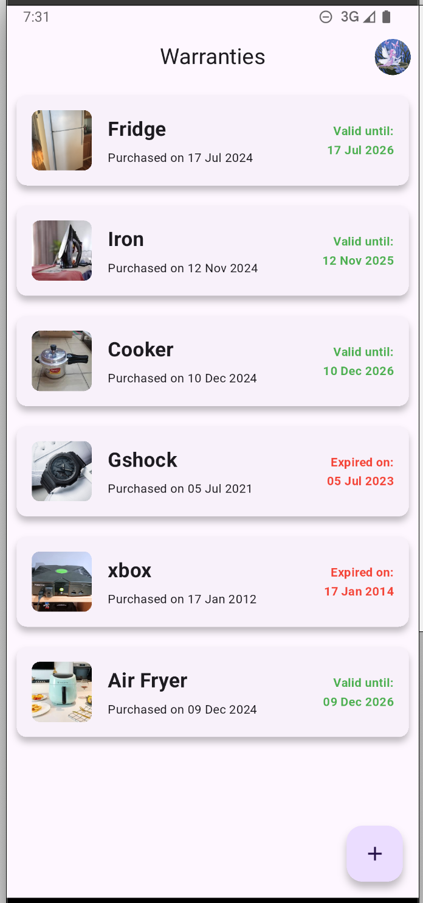
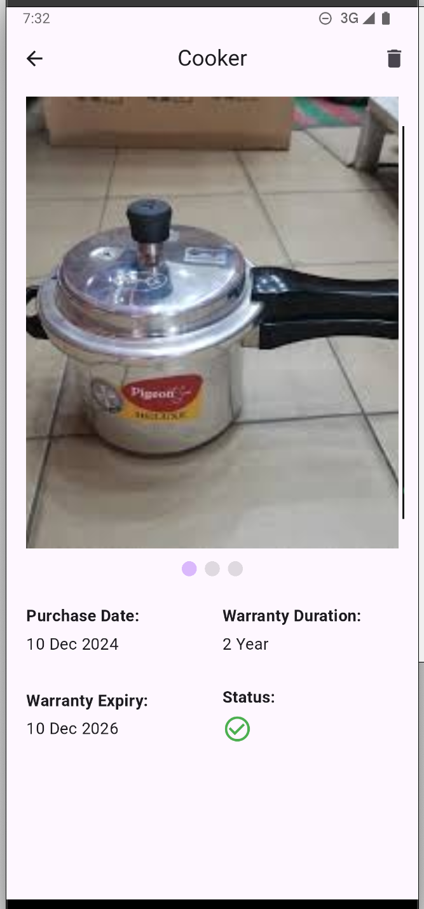
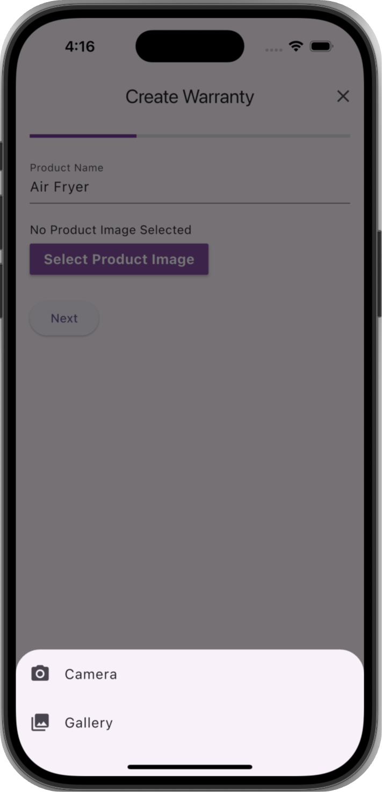

# Warranti

This is a simple app written using [Flutter](https://docs.flutter.dev/).

**Get Started!** 

Download our app and take control of your purchases. Store, track, and never lose a warranty again!

---

## Screenshots

**Signin Page**

---

**Home Screen**

---

**Warranty Screens**

---

**Create Warranty Page**

---

## 🔧 About the App

Warranti is a Flutter app backed by a Node.js (Express) server. The app helps users manage and track product warranties efficiently and securely.

- **Frontend:** Flutter (Dart)
- **Backend:** [Node.js with Express](https://github.com/preetiGusain/warranti-backend)
- **Live Website:** [warranti.in](https://warranti.in/)

---

## Why Choose Warranti

**Convenience**  
Stop scrambling for paperwork when something breaks. Everything you need is in one place.

**Security**  
Your warranties are securely stored in encrypted cloud storage, ensuring complete safety and easy access.

**Time-Saving**  
Say goodbye to manual tracking and searching for receipts. Access all your warranty documents with ease.

---

## How It Works

1. **Create an account** using email, Google, or other sign-in options.  
2. **Tap the Create icon** on the Home Page to add a new warranty.  
3. **Upload your receipts** along with product details.  
4. **View and manage** your warranties anytime, anywhere.

---

## Benefits

### Automatic Tracking  
Warranti tracks warranty expiration dates and sends timely reminders so you never miss a deadline.

### Easy Upload  
Upload receipts and warranty documents instantly from your mobile.

### Secure & Accessible  
Your warranties are stored in encrypted cloud storage, accessible from any device.

### Warranty Management  
Effortlessly access and manage all stored warranties from one centralized dashboard.

---

## Our Mission

**Simplifying warranty management.**

---

## Contact

📧 Email: support@warranti.in

---
